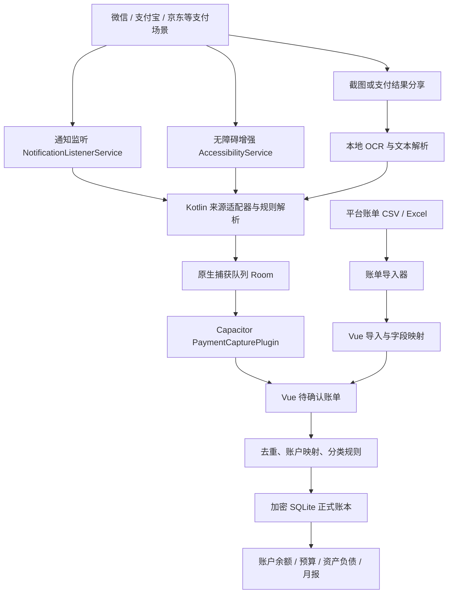

# 财务经理 APP：技术选型与自动记账方案

> 文档状态：开发基线草案  
> 更新日期：2026-08-02  
> 目标平台：Android（优先适配小米 17 Pro Max / HyperOS）  
> 产品原则：本地优先、数据可迁移、自动记账可解释、任何识别结果都可追溯和修正。

## 1. 结论

推荐采用 **Vue 3 + TypeScript + Vite + Capacitor + Kotlin + SQLite** 的混合架构。

- Vue 3 负责全部业务页面、交互、报表和设计系统，保留现有技术熟悉度。
- Capacitor 负责把 Vue 应用封装为 Android APP，并提供 Web 与原生之间的桥梁。
- Kotlin 只处理 Vue 无法可靠完成的安卓能力：通知监听、无障碍增强识别、分享接收、后台任务和系统权限状态。
- SQLite 作为本地账本数据库；金额采用整数最小货币单位保存，数据库支持版本迁移和完整导出。
- 自动记账采用多通道策略：**通知监听优先，无障碍增强，账单导入和截图分享识别兜底**。
- 新识别的支付先进入“待确认账单”。经过一段时间校准后，才允许用户对特定来源开启高置信度自动入账。

不建议把整个 APP 改为 Flutter 或纯原生 Android。当前产品的大多数复杂度在账本、资产、报表和页面交互，Vue 3 足以胜任；只有少数系统能力需要 Kotlin。

## 2. 总体架构



关键约束：通知服务或无障碍服务可能在 Vue WebView 没有启动时运行，因此不能依赖前端内存状态。原生层先把事件写入独立捕获队列，APP 打开后再由 Capacitor 插件交给 Vue 处理。

## 3. 技术栈

| 层级 | 推荐技术 | 用途与约束 |
|---|---|---|
| 前端语言 | TypeScript | 领域模型、金额与账户类型均使用严格类型 |
| 前端框架 | Vue 3 Composition API、`<script setup>` | 页面与业务组件 |
| 构建工具 | Vite | 本地开发、生产构建 |
| 路由 | Vue Router | 页面导航和路由守卫 |
| 状态管理 | Pinia | 当前账本、筛选条件、权限状态等运行时状态；数据库仍是事实来源 |
| 移动交互组件 | Vant 4，按需引入 | 日历、选择器、弹层、滑动、Toast 等成熟触屏行为；外观统一封装 |
| 功能图标 | Lucide 官方 Vue 包 | 统一线性图标、尺寸和描边；账户品牌标识另行管理 |
| 动画 | Vue Transition + Motion for Vue | 普通过渡使用 Vue/CSS，复杂布局和手势才使用 Motion |
| 原生容器 | Capacitor 8.x | 将 Vue 构建产物运行在 Android WebView 中，并桥接原生 API |
| Android 原生语言 | Kotlin | 通知、无障碍、分享接收、WorkManager、权限设置跳转 |
| 正式账本数据库 | `@capacitor-community/sqlite` + SQLCipher | 本地持久化、事务、迁移、可选数据库加密 |
| 原生捕获队列 | Android Room | APP 未启动时暂存支付事件，与正式账本解耦 |
| 数据校验 | Zod | 导入文件、插件事件和表单输入校验 |
| 日期处理 | Day.js | 日期展示与账期计算；数据库保存 ISO 时间和时区信息 |
| 图表 | Apache ECharts，按需引入 | 月报、资产趋势、分类分析；优先 Canvas 渲染 |
| OCR | Google ML Kit Text Recognition v2 | 本机识别分享进来的支付截图，默认不上传图片 |
| 后台任务 | Android WorkManager | 定期备份、索引整理等可延迟且必须可靠执行的任务 |
| 单元测试 | Vitest + Vue Test Utils | 领域规则、组件、数据转换 |
| 端到端测试 | Playwright + Android 真机测试 | Web 页面流程以及真机权限、支付识别回归 |

依赖版本在项目初始化时锁定到互相兼容的稳定版本并提交 lockfile，不在文档里写死每个补丁版本。Capacitor 官方支持在现代 JavaScript 项目中直接加入 Android 平台，也支持用 Kotlin/Java 编写本地插件桥接原生 API。

### 3.1 UI 实现建议

- 不采用 Ionic 的默认组件外观，避免成品带有明显模板感。
- 建立自己的 Vue 品牌组件：`AppPage`、`AppTopBar`、`MoneyText`、`LedgerCard`、`TransactionRow`、`AccountAvatar`。
- 样式使用 CSS Variables + SCSS，严格复用现有 UI 规范中的字号、间距、圆角和颜色 token。
- 金额使用等宽数字特性 `font-variant-numeric: tabular-nums`；普通正文控制在 14–16sp，只有核心金额使用 28–30sp。
- 摄影图只放在首页、月报等情绪化头图区域，业务操作页继续使用白底和高密度列表。

### 3.2 组件实施策略：成熟交互内核 + 自有视觉封装

不会从零手写日历、日期选择、弹层、滑动单元格和焦点管理，也不会直接把一套组件库的默认皮肤铺满整个 APP。

推荐的最终组合：

| 领域 | 采用方案 | 处理原则 |
|---|---|---|
| 移动交互组件 | Vant 4 | 使用成熟逻辑、手势、安全区和边界处理，外层封装并覆盖设计 Token |
| 功能图标 | Lucide 官方 Vue 包 | 统一 16/20/24/32dp 与 1.75dp 描边，不使用 Vant Icons |
| 普通过渡 | Vue `<Transition>` / `<TransitionGroup>` + CSS | 页面、显隐、列表增删、颜色和透明度 |
| 复杂动画与手势 | Motion for Vue（`motion-v`） | 共享布局、可中断手势、数字反馈、少量弹性动画 |
| 图表动画 | Apache ECharts 自带动画 | 不在图表外再套第二套动画引擎 |
| Android 返回 | `@capacitor/app` + Vue Router | 同时支持顶部返回、系统返回键和返回手势 |
| 品牌外观 | 自有 Vue 组件 | 顶部栏、卡片、金额、摄影头图、账户头像严格按 V3 规范实现 |

Vant 4 目前提供 Vue 3 移动端需要的 Calendar、DatePicker、Picker、Popup、ActionSheet、Dialog、Toast、SwipeCell、PullRefresh、NumberKeyboard 等组件，并支持按需引入、主题定制和 Tree Shaking。项目不直接使用 `van-nav-bar`、`van-card` 等默认视觉组件作为最终页面。

#### 组件封装映射

| 财务经理组件 | 内部实现 | 是否自绘外观 |
|---|---|---:|
| `AppIconButton` | 原生 button + Lucide | 是 |
| `AppTopBar` / `PeriodTopBar` | Vue 组件 + Lucide + Router | 是 |
| `AppCalendarSheet` | Vant Calendar + Popup | 是，保留日历行为 |
| `AppPeriodPicker` | Vant DatePicker / Picker + Popup | 是，保留滚动选择行为 |
| `AppFilterSheet` | Vant Popup，内部使用自有筛选表单 | 是 |
| `AppActionSheet` | Vant ActionSheet | 主题覆盖 |
| `AppDialog` | Vant Dialog | 主题覆盖 |
| `AppToast` / `AppNotify` | Vant Toast / Notify | 主题覆盖 |
| `LedgerSwipeRow` | Vant SwipeCell + 自有 `TransactionRow` | 是，保留滑动手势 |
| `AppPullRefresh` | Vant PullRefresh | 仅定制颜色与文案 |
| `MoneyKeyboard` | Vant NumberKeyboard + 记账业务层 | 是，保留键盘行为 |

所有业务页面只导入上述 `App*` 组件，不能直接散落使用 `van-*`。这样未来替换底层组件库时，业务页面不需要整体重写。

Reka UI 是成熟的无样式可访问性原语，适合 Dialog、Popover、Select 等桌面与通用 Web 交互；但首版不同时引入 Reka 与 Vant，避免两套弹层、焦点锁定、Portal 和 z-index 系统互相冲突。如果 TalkBack 验收发现 Vant 某个组件无法满足要求，再针对单一组件评估替换。

### 3.3 返回逻辑

顶部返回按钮不是单纯的 `router.back()`。统一建立 `NavigationCoordinator`，返回优先级固定为：

1. 当前有 Popup、ActionSheet、Dialog、日历或筛选器：先关闭最上层浮层；
2. 当前处于批量选择、编辑或搜索展开状态：先退出该状态；
3. Vue Router 存在上一层页面：返回上一页；
4. 已位于根页面：交给 Android 默认行为或最小化 APP，不在普通页面强制退出。

顶部箭头、Android 系统返回键和返回手势必须调用同一个协调器。Capacitor App 插件提供 Android `backButton` 事件；一旦自行监听，就必须正确处理浏览历史和根页面行为。

### 3.4 动画规范

动画不逐页临时“手搓”，而是建立少量可复用的 Motion Token：

```css
:root {
  --motion-instant: 100ms;
  --motion-fast: 160ms;
  --motion-base: 220ms;
  --motion-slow: 280ms;
  --ease-standard: cubic-bezier(.2, 0, 0, 1);
  --ease-exit: cubic-bezier(.4, 0, 1, 1);
}
```

| 场景 | 实现 | 时长与规则 |
|---|---|---|
| 按钮按下、图标状态 | CSS | 100–160ms，只改变颜色、透明度或缩放至 0.98 |
| 页面进入/返回 | Vue Transition | 220ms；透明度 + 8dp 横移，不做整屏飞入 |
| Popup / ActionSheet / Picker | Vant 内置 | 统一覆盖为 280ms，不再嵌套 Motion |
| 卡片展开、筛选结果重排 | Motion layout | 220–280ms，可中断，不动画大面积阴影 |
| 金额确认反馈 | Motion spring 或数字插值 | 仅一次轻微反馈，不持续跳动 |
| 图表切换 | ECharts | 300ms 左右，禁止同时给卡片做位移动画 |
| 列表新增/删除 | TransitionGroup | 160–220ms；同批最多错开 5 项 |

性能与无障碍规则：

- 优先动画 `transform` 与 `opacity`，避免频繁动画 `top`、`left`、`width` 和大模糊阴影。
- 同一操作只由一个库控制动画；Vant 弹层外面不再包 Motion。
- 支持 `prefers-reduced-motion: reduce`；开启后禁用弹性、位移和列表错峰，只保留必要的短淡入淡出。
- 动画不能阻塞保存、返回和连续记账，所有关键交互必须可中断。
- 不引入 GSAP、Lottie 或 Anime.js 作为基础依赖；只有后续出现明确的品牌开场动画需求时再单独评估。

## 4. 自动记账方案比较

| 方案 | 自动程度 | 稳定性 | 权限/合规风险 | 推荐定位 |
|---|---:|---:|---:|---|
| 通知监听 | 高 | 中高 | 中 | 第一优先级 |
| 无障碍读取支付成功页 | 高 | 中 | 高 | 用户主动开启的增强模式 |
| 平台账单 CSV/Excel 导入 | 低 | 高 | 低 | 对账和补漏的可靠底线 |
| 分享支付结果/截图 + OCR | 中 | 中高 | 低至中 | 无通知时的一步式兜底 |
| 短信读取 | 高 | 中 | 很高 | MVP 不采用 |
| 银行开放接口 | 高 | 取决于机构 | 接入门槛高 | 暂不作为个人版基础能力 |

### 4.1 通知监听：默认自动捕获方式

通过 Android `NotificationListenerService` 接收新通知，并且只处理用户启用的包名白名单，例如微信、支付宝、京东、抖音和美团。

优点：

- 比无障碍权限更窄，不需要扫描屏幕上的其他内容。
- 即使财务经理 APP 不在前台，也能收到系统转交的通知事件。
- 适合提取支付金额、商户、时间和支付平台。

局限：

- 某些版本的支付 APP 不发通知，或者通知中不包含完整金额、商户和付款银行卡。
- 用户关闭支付通知、系统限制后台、通知样式变更时会漏记。
- 如果只知道“微信支付”，但不知道实际扣款银行卡，就必须记入“微信支付待匹配”，不能无依据猜测账户。

### 4.2 无障碍服务：增强识别，不做自动操作

无障碍服务只用于识别白名单支付 APP 的“支付成功”页面文本。它应遵守以下边界：

- 只读页面节点，不点击按钮、不输入文字、不执行手势，也不替用户完成支付。
- XML 配置和运行时逻辑都限制允许识别的包名。
- 只提取记账所需字段，不读取密码、支付码、聊天消息、联系人或无关页面。
- 用户在 APP 内看到清晰说明后主动开启，随时可以关闭并删除捕获记录。
- 权限页展示“最近一次捕获时间、来源、解析器版本和服务健康状态”。

这种方案对扫码支付成功页覆盖较好，但支付 APP 更新 UI 后解析规则可能失效，因此每个平台必须有独立的版本化适配器和回归样本。

若未来上架 Google Play，非无障碍辅助类应用使用 Accessibility API 需要完成用途声明、显著披露与明确同意，并且应优先使用能满足需求的更窄 API。个人侧载 APK 不经过商店审核，但隐私与安全边界仍应保持一致。

### 4.3 分享与本地 OCR：低风险兜底

财务经理注册 `ACTION_SEND` 接收入口。用户在支付结果或相册中点击“分享给财务经理”，APP 接收文字或图片，并使用 ML Kit 在本机识别金额、商户和时间。

- 不需要读取整个相册，只处理用户本次明确分享的内容 URI。
- OCR 图片默认用完即删，不上传云端。
- 识别后进入同一个待确认页面，用户补充账户与分类即可。

### 4.4 账单导入：必须保留的对账能力

微信、支付宝、银行卡等来源的账单文件是自动捕获的校验底线。导入器需要支持：

- 来源模板识别、编码和列名兼容；
- 导入预览、错误行说明和重复交易检测；
- 使用来源订单号，或“来源 + 时间 + 金额 + 商户”的指纹去重；
- 将已存在的自动捕获记录与正式账单进行合并，而不是再次入账；
- 用户可保存账户映射和分类规则，下一次导入自动复用。

## 5. 自动记账的数据流程

### 5.1 捕获事件模型

```ts
interface CapturedPayment {
  id: string
  sourcePackage: string
  captureMethod: 'notification' | 'accessibility' | 'share' | 'import'
  occurredAt: string
  amountMinor?: number
  currency: 'CNY'
  merchant?: string
  accountHint?: string
  sourceOrderId?: string
  rawFingerprint: string
  confidence: number
  parserVersion: string
}
```

原始通知文本或页面文本仅在解析所必需的短周期内暂存。正式队列优先保存结构化字段和去重指纹；调试样本必须经过用户主动同意并脱敏。

### 5.2 入账规则

1. 捕获到支付事件后，先执行来源白名单检查和敏感字段过滤。
2. 原生适配器解析金额、商户、时间、账户线索，生成置信度。
3. 通过订单号或事件指纹检查重复。
4. 默认进入“待确认账单”，Vue 根据用户历史规则建议账户与分类。
5. 用户确认后，使用一个 SQLite 事务同时写入交易、分录、账户余额缓存和规则反馈。
6. 当某个来源和规则经过足够多次确认后，用户可以单独开启“高置信度自动入账”；仍需保留撤销和审计记录。

建议的初始策略：

- 金额缺失或账户不明：必须人工确认。
- 同一分钟内出现相同金额、相同来源：标为疑似重复，不自动入账。
- 退款、转账、红包、充值和信用卡还款不能统一当作收入或支出，必须按交易类型生成对应分录。
- 所有自动生成记录显示“来源、捕获方式、解析规则版本”，方便发现错误。

## 6. Capacitor 原生插件边界

建立一个本地 Kotlin 插件 `PaymentCapturePlugin`，不要依赖维护状态不明、权限范围不清楚的第三方无障碍插件。

建议暴露的接口：

```ts
interface PaymentCapturePlugin {
  getPermissionStatus(): Promise<PermissionStatus>
  openNotificationAccessSettings(): Promise<void>
  openAccessibilitySettings(): Promise<void>
  getServiceHealth(): Promise<ServiceHealth>
  listPendingEvents(options?: { after?: string }): Promise<CapturedPayment[]>
  acknowledgeEvents(options: { ids: string[] }): Promise<void>
  deleteCapturedEvent(options: { id: string }): Promise<void>
  runSelfTest(): Promise<SelfTestResult>
}
```

插件按小职责拆分内部模块：

- `PaymentNotificationListener`：接收通知；
- `PaymentAccessibilityService`：只读白名单页面；
- `PaymentShareActivity`：接收用户分享的文字或图片；
- `SourceAdapterRegistry`：按包名和规则版本选择解析器；
- `CaptureQueueRepository`：Room 队列与去重；
- `PaymentCapturePlugin`：仅负责 Vue 与原生之间的数据交换。

## 7. 本地数据库设计要点

- 金额使用整数分，例如 `1396.97` 保存为 `139697`，避免浮点误差。
- 交易与分录分开：一笔“信用卡还款”是一项业务交易，但会生成两个账户之间的转账分录。
- 账户余额由分录计算，缓存只用于加速，必须可以重建。
- 所有表包含 `created_at`、`updated_at`；自动记录另存 `capture_source`、`parser_version`、`confidence`。
- 每次数据库升级提供可重复验证的 migration，不允许启动时直接重建用户数据库。
- 备份格式同时提供加密完整备份和可读 CSV/JSON 导出，避免未来项目停止后数据无法迁移。

建议的核心仓储：

```text
LedgerRepository
AccountRepository
TransactionRepository
BudgetRepository
ReceivableRepository
LiabilityRepository
InvestmentRepository
ImportRepository
CaptureInboxRepository
```

## 8. “别人欠我钱 / 借出款”需要单独补页

当前 V2 UI 确实缺少一个直接管理借出款的页面。后续补充以下三类页面：

1. **应收款列表**：待收、部分收回、已结清、逾期；显示对方、剩余金额、到期日。
2. **新建借出款**：对方、借出账户、本金、借出日、约定归还日、备注、是否计息。
3. **应收款详情**：借出记录、历次收回、剩余本金、利息、提醒和一键“收到还款”。

会计口径必须正确：

- 借出 1,000 元：银行卡减少 1,000，应收款资产增加 1,000，**不是消费支出，净资产不变**。
- 收回本金：银行卡增加，应收款减少，**不是收入**。
- 收到利息：利息部分计入收入。
- 确认无法收回：剩余本金转为坏账损失，才计入损失类支出。

数据模型建议：

```ts
interface Receivable {
  id: string
  counterparty: string
  principalMinor: number
  outstandingMinor: number
  lentAt: string
  dueAt?: string
  status: 'open' | 'partial' | 'settled' | 'overdue' | 'written_off'
  sourceAccountId: string
  transactionId: string
  note?: string
}
```

## 9. 小米 / HyperOS 适配清单

- 首次启用自动记账时，分步骤检查通知访问权和无障碍服务状态。
- 提供“后台运行诊断”，提示用户检查自启动、后台省电限制和通知权限；文案不承诺 100% 不漏记。
- 每次启动检查服务是否被系统关闭，并只做状态提示，不反复强制弹窗。
- 真机测试锁屏支付、扫码支付、指纹/密码支付、退款、红包、信用卡付款和不同字体缩放。
- 适配系统导航栏、状态栏和挖孔区域，页面使用动态 WindowInsets，不写死顶部高度。
- 为不同微信、支付宝和 HyperOS 版本保存脱敏回归样本，解析器升级后批量测试。

## 10. 安全与隐私底线

- 默认离线可用；不要求注册账号才能记账。
- 数据库加密密钥放入 Android Keystore，不硬编码在 JavaScript 或安装包中。
- 不采集支付密码、验证码、聊天内容、联系人、剪贴板历史或完整屏幕录像。
- 不把无障碍原始节点树、通知全文和截图上传服务器。
- 权限按需申请，并在系统授权页之前给出单独、明确、可拒绝的用途说明。
- 自动记账权限关闭后，手工记账、导入、报表、备份全部仍可使用。
- 提供完整导出、备份校验、恢复预览和一键删除本地数据。

## 11. 推荐开发阶段

### 阶段 A：账本基础与数据安全

- Vue 3 页面骨架、设计 token、路由与 Pinia；
- SQLite schema、migration、账户/交易/转账；
- 手工记账、待确认账单、CSV 导入导出；
- 本地备份恢复；
- 补齐“借出款 / 应收款”页面和正确分录。

### 阶段 B：通知自动捕获

- Kotlin `NotificationListenerService`；
- 微信、支付宝首批通知适配器；
- 捕获队列、去重、权限诊断；
- 待确认页与用户规则学习。

### 阶段 C：无障碍增强与截图分享

- 只读型 `AccessibilityService`；
- 分享接收和本地 OCR；
- 京东、美团、抖音等来源适配；
- 解析器版本、健康检查和真机回归集。

### 阶段 D：自动化与发布准备

- 高置信度来源的可选自动入账；
- 定期备份与恢复演练；
- 隐私政策、权限披露、数据安全说明；
- 性能、耗电、无障碍误采集和商店政策审查。

## 12. 首个可开发目录结构

```text
finance-manager/
├─ src/
│  ├─ app/
│  ├─ components/
│  ├─ design-system/
│  ├─ features/
│  │  ├─ ledger/
│  │  ├─ accounts/
│  │  ├─ capture-inbox/
│  │  ├─ imports/
│  │  ├─ receivables/
│  │  ├─ liabilities/
│  │  ├─ budgets/
│  │  └─ reports/
│  ├─ db/
│  │  ├─ migrations/
│  │  ├─ repositories/
│  │  └─ schema/
│  ├─ native/
│  ├─ stores/
│  └─ types/
├─ android/
│  └─ app/src/main/java/.../capture/
│     ├─ notification/
│     ├─ accessibility/
│     ├─ share/
│     ├─ adapters/
│     ├─ queue/
│     └─ plugin/
├─ tests/
└─ docs/
```

## 13. 主要官方资料

- [Vue 3：Composition API 与 TypeScript](https://vuejs.org/guide/typescript/composition-api.html)
- [Vue 3：Transition 与 TransitionGroup](https://vuejs.org/guide/built-ins/transition.html)
- [Pinia 官方介绍](https://pinia.vuejs.org/introduction.html)
- [Vant：Vue 3 移动端组件库](https://github.com/youzan/vant)
- [Lucide for Vue](https://lucide.dev/guide/vue)
- [Motion for Vue](https://motion.dev/docs/vue)
- [Capacitor：加入现有 Web 应用](https://capacitorjs.com/docs/getting-started)
- [Capacitor：创建原生插件](https://capacitorjs.com/docs/plugins/creating-plugins)
- [Capacitor Android：使用 Kotlin/Java 自定义代码](https://capacitorjs.com/docs/android/custom-code)
- [Capacitor App：Android 返回键事件](https://capacitorjs.com/docs/apis/app)
- [Android NotificationListenerService](https://developer.android.com/reference/android/service/notification/NotificationListenerService.html)
- [Android AccessibilityService](https://developer.android.com/reference/android/accessibilityservice/AccessibilityService.html)
- [Android WorkManager 持久后台任务](https://developer.android.com/develop/background-work/background-tasks/persistent)
- [Android Sharesheet 与 ACTION_SEND](https://developer.android.com/develop/ui/compose/sharing/send)
- [ML Kit Android 文字识别](https://developers.google.com/ml-kit/vision/text-recognition/v2/android)
- [Google Play AccessibilityService 政策](https://support.google.com/googleplay/android-developer/answer/10964491?hl=zh-Hans)
- [Google Play 显著披露与用户同意要求](https://support.google.com/googleplay/android-developer/answer/11150561?hl=zh-Hans)
- [Capacitor Community SQLite](https://github.com/capacitor-community/sqlite)
- [Apache ECharts 按需引入](https://echarts.apache.org/handbook/en/basics/import/)
